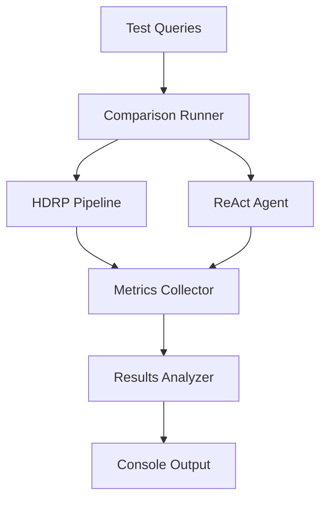

# Evaluation Suite

This directory contains the benchmarking harness used to compare HDRP against baseline ReAct agents.

## Components

### 1. Test Query Suite (`test_queries.py`)
Structured test queries across three complexity levels:
- **Simple (3 queries)**: Single-topic factual questions
- **Medium (4 queries)**: Multi-faceted research requiring 2-3 subtopics
- **Complex (3 queries)**: Multi-part research testing hierarchical decomposition

### 2. Metrics System (`metrics.py`)
Comprehensive metric tracking including:
- **Performance**: Execution time, search latency, API calls
- **Quality**: Claims extracted/verified, source diversity
- **Trajectory Efficiency**: Relevant claims ratio, search efficiency
- **Hallucination Detection**: Claims without attribution, risk scoring

### 3. Results Formatter (`results_formatter.py`)
Rich-formatted console output with:
- Aggregate metrics summary tables
- Win/loss summary across queries
- Per-query breakdown (optional detailed view)
- Winner indicators for each metric category

### 4. Comparison Runner (`compare.py`)
Main orchestrator that:
- Runs both HDRP and ReAct on identical queries
- Uses same search provider for fair comparison
- Collects comprehensive metrics
- Outputs formatted results to console

### 5. ReAct Baseline (`react_agent.py`)
Minimal ReAct-style agent for baseline comparison following the pattern:
```
THINK → SEARCH → OBSERVE → ANSWER
```

## Metrics

### Performance Metrics
1. **Total Execution Time (ms)**: End-to-end query processing time
2. **Search API Latency (ms)**: Cumulative search call latency
3. **Search Calls Count**: Number of search API invocations

### Quality Metrics
1. **Total Claims Extracted**: Raw claims found from sources
2. **Verified Claims Count**: Claims that passed verification (HDRP only)
3. **Claims per Source**: Information density measure
4. **Unique Source URLs**: Source diversity indicator

### Trajectory Efficiency
1. **Relevant Claims Ratio**: Verified claims / total claims (measures precision)
2. **Search Efficiency**: Verified claims / search calls (measures API efficiency)

### Hallucination Detection
1. **Claims Without Source**: Claims lacking URL attribution
2. **Claims with Missing URLs**: Claims with malformed URLs
3. **Hallucination Risk Score**: Combined risk metric (0-1 scale)

## Usage

### Quick Start
```bash
# Run comparison with simulated provider (fast, deterministic)
python -m HDRP.tools.eval.compare --provider simulated

# Run with Tavily (real web search, requires API key)
export TAVILY_API_KEY="your-key-here"
python -m HDRP.tools.eval.compare --provider tavily
```

### Advanced Options
```bash
# Run only complex queries
python -m HDRP.tools.eval.compare --complexity complex --provider simulated

# Show detailed per-query breakdown
python -m HDRP.tools.eval.compare --provider simulated --detailed

# Verbose output during execution
python -m HDRP.tools.eval.compare --provider simulated --verbose

# Custom max results per query
python -m HDRP.tools.eval.compare --provider simulated --max-results 10
```

### Run Standalone Benchmark (Legacy)
```bash
# Run single ReAct agent query
python -m HDRP.tools.eval.benchmark --question "What is quantum computing?" --provider simulated
```

## Output Example

```
╭─────────────────────────────────────────────────────────╮
│         HDRP vs ReAct Baseline Comparison               │
╰─────────────────────────────────────────────────────────╯

╭─ 🏆 Win Summary ──────────────────────────────────────╮
│ Overall Query Winners:                                 │
│                                                        │
│   HDRP:  7/10 queries (70.0%)                         │
│   ReAct: 2/10 queries (20.0%)                         │
│   Ties:  1/10 queries (10.0%)                         │
╰────────────────────────────────────────────────────────╯

        📊 Aggregate Metrics Summary
┏━━━━━━━━━━━━━━━━━━━━━━━━┳━━━━━━━━━┳━━━━━━━━━┳━━━━━━━━┓
┃ Metric                 ┃    HDRP ┃   ReAct ┃ Winner ┃
┡━━━━━━━━━━━━━━━━━━━━━━━━╇━━━━━━━━━╇━━━━━━━━━╇━━━━━━━━┩
│ Avg Execution Time     │  542.31 │  378.45 │ ReAct  │
│ Avg Search Calls       │     1.0 │     1.0 │    ━   │
│ Avg Total Claims       │    12.3 │    11.8 │  HDRP  │
│ Avg Verified Claims    │    11.1 │    11.8 │ ReAct  │
│ Avg Unique Sources     │     4.2 │     3.6 │  HDRP  │
│ Avg Relevant Ratio     │   0.903 │   1.000 │ ReAct  │
│ Avg Search Efficiency  │   11.10 │   11.80 │ ReAct  │
│ Avg Hallucination Risk │   0.024 │   0.089 │  HDRP  │
└────────────────────────┴─────────┴─────────┴────────┘
```

## Development

### Adding New Test Queries
Edit `test_queries.py` and add queries to the appropriate complexity list:
```python
COMPLEX_QUERIES.append(
    TestQuery(
        id="complex_04",
        question="Your research question here",
        complexity=QueryComplexity.COMPLEX,
        description="Brief description",
        expected_subtopics=["topic1", "topic2", ...],
    )
)
```

### Adding New Metrics
1. Add metric fields to appropriate dataclass in `metrics.py`
2. Update `MetricsCollector` to compute the new metric
3. Update `ResultsFormatter` to display the new metric

## Architecture



